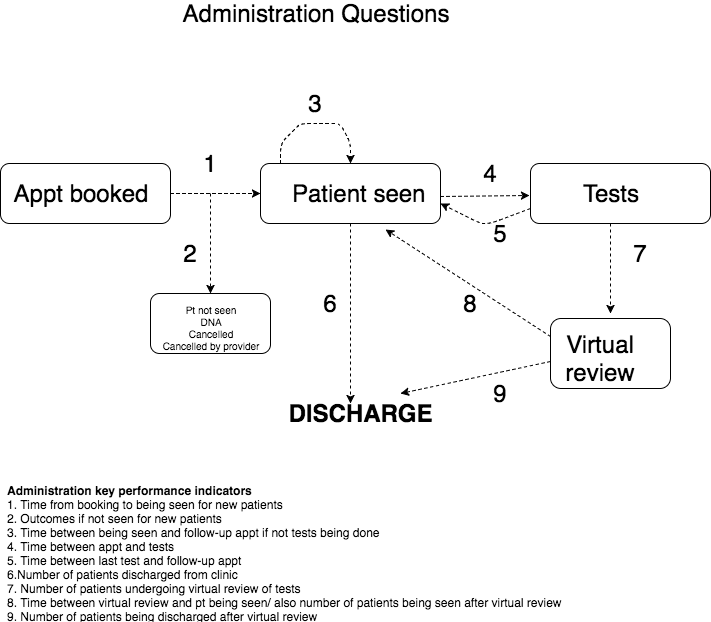

```{r setup, include=FALSE}
knitr::opts_chunk$set(echo = TRUE)
library(knitr)
library(ggplot2)
```

##Retrospective bookings:

Inevitably, if you are a gastroenterologist, you are going to have to organise your department somehow. This is usually a total nightmare and involves having little access to data and usually flying by the seat of your pants....but does it have to be like this?
Most hospitals have some kind of electronic booking system for appointments and this records every patient episode where a booking has been made. It often records when a patient has not attended, or has been cancelled an appointment, and is obviously organised around the date of the booking episode. What a rich resource.

In general the flow of patients coming to see gastroenterologists, and doctors in general, goes like this:

<br><br>



<br><br>

And once we understand the flow, we can start to develop a framework to measure the flow through the system. 

You need, of course, to be able to access and download the data you are interested in. For example, I can access gastroenterology data for all appointments within any timeframe. I then specify the service I am interested in, in gastroenterology by specifying the service I am interested in (ie physiology, or outpatients in hepatology etc). My data looks like this:


```{r Appointments_data}
library(lubridate)
#Lets generate some hospital numbers
HospNumId<-sample(paste(sample(letters[1:4]),sample(seq(1000000, 9999999),size=1000),sep=""))
#Lets generate some appointment dates which also have time 
ApptDate<-sample(seq(as.Date('2013/02/01'), as.Date('2013/03/01'), by="day"),replace=T, 1000)
Time<-paste(sample(9:15,1000,replace=T),":",sample(seq(0,59,by=15),1000,replace=T),sep="")             
FinalPOSIXApptDate<-as.POSIXct(paste(ApptDate," ",Time,sep=""))

#Lets generate the dates when appointments were actually booked
ApptDateBooked<-sample(seq(as.Date('2013/01/01'), as.Date('2013/01/31'), by="day"),replace=T, 1000)
TimeBooked<-paste(sample(9:15,1000,replace=T),":",sample(seq(0,59,by=15),1000,replace=T),sep="")             
FinalPOSIXBookedDate<-as.POSIXct(paste(ApptDateBooked," ",TimeBooked,sep=""))


#Lets generate some test types
TestType<-sample(c("Oesophageal Lab","Breath Tests","Manometry only"),1000,replace=T)
#And some outcomes
Outcome<-sample(c("DNA","Cancelled By Patient","Cancelled by Provider","Patient seen"),1000,replace=T)
Appts<-data.frame(HospNumId,TestType,FinalPOSIXBookedDate,FinalPOSIXApptDate,Outcome)

```

##Outcomes of bookings:

We can start our metrics by looking at point 1 and 2- what happens to patients booked for an appointment and what is the appointment utilization compared with this. With this dataset I can do some straightforward visualisations of what has been going on in the unit over, in this case, the previous month, (or over the previous 10 years to show how demand has changed if I wanted).

Of course I want to also know the following because it affects how we get paid....How many cancellations have there been, how many DNAs, and how many attended. This is easy to do. We just need to create a table by week and appointment outcome as follows

```{r Appointments_OutsomeMatrix}
summAT<-as.matrix(table(Appts$Outcome,Appts$TestType))
kable(summAT)
```

<br><br>

This can also be visualised:

<br><br>

```{r Appointments_OutcomeMatric_ggplot}
ggplot(Appts,aes(x=week(FinalPOSIXApptDate),fill=Outcome))+geom_histogram(binwidth = 1)+
  labs(title="Facet plot of attendance type by session code in the oesophageal physiology lab for the last 4 weeks from report run date") +
  facet_grid(TestType ~ .)

```  
  
<br><br>

##Examination of appointment usage

I am also obviously keen to organise the department so that we can make use of all appointments and not waste any. I want to see how many appointments we have booked in for the next month in the monrning and the afternoon. I will make use of the nice heatmap provided by the [pheatmap package](https://cran.r-project.org/web/packages/pheatmap/pheatmap.pdf) to make this easier to visualise:

```{r Appointments_Available}
library(lubridate)

#Tabulate the data so we can see how many patients are booked into each time slot

MyAppts<-data.frame(table(Appts$FinalPOSIXBookedDate,Appts$TestType))
MyAppts$HourMin<-hour(ymd_hms(MyAppts$Var1)) + minute(ymd_hms(MyAppts$Var1))/60
MyAppts$Day<-day(as.Date(MyAppts$Var1))

#Now lets create a kind of heatmap with geom_tile:

ggplot(MyAppts, aes(x=HourMin, y=Day, fill=Freq))+ 
  geom_tile(color="white", size=0.1)+ 
  facet_wrap(~Var2, ncol=2)+
  geom_text(label=MyAppts$Freq)+
  scale_fill_gradient(low="green",high="darkgreen")+
labs(x=NULL, y=NULL, title="Events per weekday & time of day")+
  theme(plot.title=element_text(hjust=0))+
  theme(axis.ticks=element_blank())+
  theme(axis.text=element_text(size=7))+
  theme(legend.title=element_text(size=8))+
  theme(legend.text=element_text(size=6))

```

So now I know how busy we are going to be. But hang on, there are some empty slots, for whatever reason. Why don't I see who has been waiting a long time to undergo their physiology testing, and move them forward. 


