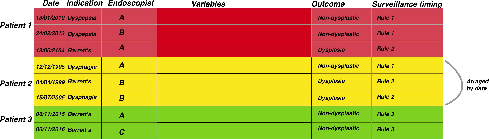

```{r setup, include=FALSE}
knitr::opts_chunk$set(echo = TRUE,warning=FALSE, message=FALSE)
library(stringr)
library(dplyr)
library(lubridate)
library(ggplot2)
library(knitr)
```

##Principles of Surveillance data analysis

Now we have an understanding of the basic data structure we need (see home page) and we know how to wrangle our data as some basic methodologies, we can start to build our cornerstone projects.

The first one to consider is surveillance. Surveillance programmes are ubiquitous in medicine and an essential part of preventive medicine.

The problem of surveillance from a data science point of view is that the timing of a subsequent investigation can be dependent on a previous investigation result. Sometimes the surveillance timing depends on other factors such as family history or date since the original diagnosis.

Regardless of the dependencies of surveillance timings, essentially surveillance relies on knowing the timing of a test and the test result along with other factors mentioned above

So essentially the problem is 

**                                              (Date of test)+(Test Result)+(Other external data)**

This then starts as a data merging problem. We can look at a fairly simple surveillance programme, namely Barrett's surveillance. This is simple because the rules for the next endoscopy depend on the histopathological results of the previous endoscopy (the presence or absence of intestinal metaplasia) as well as the length of the Barrett's segment, which should be recorded in the endoscopy report.

The second issue we must understand is that the date of the test combined unique patient ID is a combined index and that our data structure needs to be grouped by patientID and then arranged according to date before further processing is done


So we need to merge the endoscopy and pathology reports for each patient and then we need to extract information from text. We learnt about learning [here](http://gastrodatascience.com/Data_merge.html)
<br><br><br><br><br><br>

<br><br><br><br><br><br>

The figure above demonstrates the general approach once the data has been merged. The patient episodes are organised by patientID and then secondarily arranged by date
<br><br><br><br><br><br>

<br><br><br><br><br><br>

Once the data has been properly arranged we can then make an attempt at deciding when the patient should return for a subsequent investigation. This is the basis of the figure above where the Rule column is derived from other columns such as the endoscopy report and detection of dysplasia among other factors. It is only a small step from there to deciding who has missed surveillance, who is due, the number of patients going through the programme, forecasting capacity and a huge number of other tasks.


We have of course already looked at these problems so we will use our code template to build up the project results. Firstly we build the histopathology data set (this is also a good education in the sample(), rep() and replicate() functions for random sampling as well as string interpolation in case you are interested). Some of the reports may not make much sense for pathologists but that is to be expected as we are randomly generating reports.
<br><br><br>

Firstly we will do some input data creation- we will get this from the external data script:

```{r Surveillance_data}
#To get the prepared endoscopy reports we are going to use the pre-prepared dataset here:
EndoHistoMerge<-source('EndoPathMerged_ExternalCode.R')
EndoHistoMerge<-as.data.frame(EndoHistoMerge)
names(EndoHistoMerge)<-gsub("value.","",names(EndoHistoMerge),fixed=T)

```

<br>

## Data analysis levels:

The analysis of surveillance data is basically segregated into three main areas as follows:

**Patient level data**

Who needs to be followed up and when according to previous studies

**Basic aggregated level**

How many patients have had a certain diagnosis during surveillance? eg dysplasia detection rate.
How many people have had a diagnosis in a certain order during surveillance? eg IM then no IM.
How many people have been followed up monthly / yearly ?

**Modelling level**

How many people will need to be followed up?


We are mainly going to talk about the patient level and modelling data level as the basic aggregated level really requires the information on cross referencing endoscopy and pathology and is covered in the pages [here](http://gastrodatascience.com/Cornersteon_EndoPath.html)
To ilustrate the types of analyses let us use the Barrett's oesophagus we have created as an example:

We are interested in understanding when patients should be returning for a further endoscopy based on the results from the previous endoscopy. The rules (simplified) are that:

 1. If you have a short segment of Barrett's (M<3), and there is no intestinal metaplasia in the histopathology report then you should be returning in a maximum of five years. 
 2. If you have a short segment of Barrett's (M<3), and intestinal metaplasia is present in the histopathology report then you should be returning in a maximum of three years.
  3. If you have a long segment of Barrett's (M>3)then you should be returning in a maximum of two years regardless of what the histopathology report says
  
###Patient level data

  Firstly we want to find out which patients have not had their endoscopies yet so need to be recalled.
  
  We do this as follows:
  
   a) Extract in to a seperate column all those with intestinal metaplasia
   b) Define the rules depending on as per above and extract these rules based on each persons latest report
   c) Arrange the procedure dates in time order.
   d) Determine the length of time since the last endoscopy and see whether this is acceptable within the rule set
   
   <br>
   
   Firstly we need to perform a conditional extraction as we learnt [here](http://gastrodatascience.com/WranglingDataFromDataMutate.html#using_multiple_ifelse())
   
   
   
<br><br>
    
```{r Surveillance_IM_Extraction} 
#Lets extract the intestinal metaplasia first
#Note I have kept this simple so if a report in real life mentions that there is no intestinal metaplasia, we won't be able to differentiate. #More to come on this tricky problem of excluding negative diagnoses.
EndoHistoMerge$IM<-ifelse(grepl("[Ii]ntestinal [Mm]etaplasia",EndoHistoMerge$Diagnoses,perl=TRUE),"IM","No IM")
```
<br>
As we are interested in only the last endoscopy that a patient had we need to group by dates and extract just the last endoscopy within a group as follows:

```{r Surveillance_Last} 
LastEndoscopy<-EndoHistoMerge %>% group_by(EndoHospNumId)%>%arrange(Date.x)%>%filter(row_number()==n())
```

<br>

As a side note, if you want to find the first endoscopy that a patient had you simply need to change the row number to 1 as follows:

```{r Surveillance_First} 
LastEndoscopy<-EndoHistoMerge %>% group_by(EndoHospNumId)%>%arrange(Date.x)%>%filter(row_number()==1)
```

<br>

Now we have to determine the rule set that the patient belongs to based on that last endoscopy:
```{r Surveillance_Rules} 
LastEndoscopy$Rule<-ifelse(LastEndoscopy$IM=="No_IM" &LastEndoscopy$BarrM<3,"Rule1",
                    ifelse(LastEndoscopy$IM=="IM" &LastEndoscopy$BarrM<3,"Rule2",
                    ifelse(LastEndoscopy$BarrM>=3,"Rule3","NoRules")))
```

<br>

Now we just have to figure out the time difference between the last endoscopy and the current one which we learnt how to do [here](http://gastrodatascience.com/GroupByDates.html#get_difference_between_two_dates_in_consecutive_rows)

```{r Surveillance_DiffTime} 
LastEndoscopy<-LastEndoscopy %>% arrange(EndoHospNumId, Date.x) %>% group_by(EndoHospNumId) %>%
  mutate(diffDate = difftime(as.Date(Sys.Date()),Date.x,units = "weeks"))
```
<br>


Finally we need to subset those patients who have been waiting too long so we can book them in for an endoscopy:

```{r } 
LastEndoscopy$Follow_Up<-ifelse(LastEndoscopy$diffDate>260 &LastEndoscopy$Rule=="Rule1","Rebook",
                        ifelse(LastEndoscopy$diffDate>156 &LastEndoscopy$Rule=="Rule2","Rebook",
                        ifelse(LastEndoscopy$diffDate>104&LastEndoscopy$Rule=="Rule3","Rebook","Within Date")))
```

So now we know who to rebook. 
Clearly the methodology used above also allows for a vast number of other surveillance related issues to be examined.


###Modelling level- the 'How many' question


One of the first things we are interested in is a basic 'how many' question. Eg how many people are undergoing Barrett's surveillance. This is straightforward to do but the trick is usually to make sure we are looking at individual patients given the question, so we will need to filter a little. We can do all the data preparation in dplyr. We have done this [before](http://gastrodatascience.com/GroupByDates.html#get_difference_between_two_dates_in_consecutive_rows) 

```{r Surveillance_CapacityByPatient} 
#Barrett<-EndoHistoMerge %>% filter(str_detect(Indication, 'Barrett'))
#As unique patients
MyBarrettsPatients<-EndoHistoMerge %>% 
  filter(str_detect(Indication, 'Surv'))%>% 
  group_by(EndoHospNumId) %>%
  arrange(Date.x) %>%
  filter(row_number()==1)%>% 
  group_by(year=year(Date.x)) %>% 
  summarise(Number=n())

kable(MyBarrettsPatients)

```

Actually that is what we would have expected as the data is randomly generated and always picks up 2013 as the starting date for these patients (there are only 20 hospital numbers here). But thats fine, lets look at how many endoscopies are done, rather than how many patients. This means we just leave out the filter for row number

```{r Surveillance_CapacityByEndoscopy} 
#Barrett<-EndoHistoMerge %>% filter(str_detect(Indication, 'Barrett'))
#As unique patients
MyBarrettsEndoscopies<-EndoHistoMerge %>% 
  filter(str_detect(Indication, 'Surv'))%>% 
  arrange(Date.x) %>%
  group_by(year=year(Date.x)) %>% 
  summarise(Number=n())

kable(MyBarrettsEndoscopies)

```


###Forecasting demand

Now we know how mush endoscopy is being done on our specialised Barrett's endoscopy lists, how much do we think we are going to need to do for example in the next 10 years? This is where the forecasting packing comes into use and where we can convert our data into a Time Series analysis (see [Time Series Analysis](http://gastrodatascience.com/DataAnalysisTimeSeries.html)

Firstly we are going to convert our list of endoscopies into a weekly summary of data with the wonderful lubridate package and dplyr

```{r Surveillance_CapacityWeekly} 
WeeklyBarretts<-EndoHistoMerge %>% 
  filter(str_detect(Indication, 'Surv'))%>% 
  arrange(Date.x) %>%
  group_by(month=month(Date.x),year=year(Date.x)) %>% 
  summarise(Number=n())

names(WeeklyBarretts)<-c("month","year","freq")

#Formatting the dates (have to add in 01 as the day to make it a proper date) here I use the dmy function from lubridate to get the day month year
WeeklyBarretts$MonthYear<-paste("01_",WeeklyBarretts$month,"_",WeeklyBarretts$year,sep="")
WeeklyBarretts$MonthYear<-dmy(WeeklyBarretts$MonthYear)


#Then just plot it:
ggplot(data = WeeklyBarretts,aes(x = MonthYear, y = freq)) +
  geom_point() +
  geom_line() +
  geom_smooth(method = "loess") + 
  scale_x_date(labels = function(x) format(x, "%d-%b")) +
  theme_bw()


```

<br> 

So that gives us some info graphically about our Barrett's surveillance programme, so now we have to look into the future:

###Forecasting using ARIMA

```{r Surveillance_Forecasting} 
library(xts)
WeeklyBarretts$freq<-as.numeric(WeeklyBarretts$freq)
WeeklyBarretts<-data.frame(WeeklyBarretts)

#Just select the column you want a time series for and also how you want to index by date (done by the order.by=)
Myxts<-xts(WeeklyBarretts$freq, order.by=WeeklyBarretts$MonthYear,frequency=12,start=c(2013,1))

```

Now we have a time series object, we are going to model it. This is done by ARIMA modelling. This is a huge subject but in summary it tries to assess a moveing average by regressing to its own prior points. It is a standard part of forecasting. There are many nuances to ARIMA modelling but the forecast package is able to choose the best model for us with **auto-arima**

```{r Surveillance_ForecastingPlot} 
library(forecast)

autoplot(forecast(auto.arima(Myxts)))
forecast(auto.arima(Myxts))
```

<br>

And if we want to see what's going to happen over the next 24 months...

<br>

```{r Surveillance_ForecastingPlot_Years} 
Barrforecast<-HoltWinters(Myxts, beta=FALSE, gamma=FALSE)
autoplot(forecast(Barrforecast, h=24))
```
<br>

How to interpret this?

The plot shows that in the next few months we can expect a fairly flat level of demand for Barrett's surveillance. Great. 80% prediction interval is the dark blue shaded area, and the 95% prediction interval as a light blue shaded area

