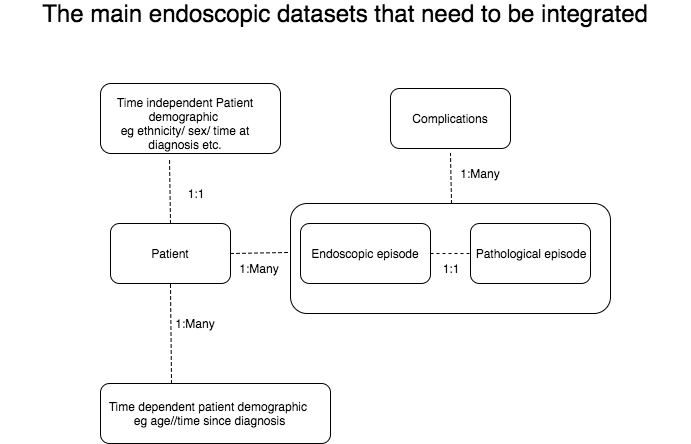

```{r global_options, include=FALSE}
knitr::opts_chunk$set(fig.width=12, fig.height=8, fig.path='Figs/',
                       warning=FALSE, message=FALSE)
```

#### So what generic questions can we answer in gastroenterology?

The answer to this is really applicable to most areas in medicine. Many fields share the same practical, day to day questions. Although we may focus on specific questions for a specific field, the structure of many questions in medicine is the same. 

Gastroenterology guidelines often present evidence based aims for gastroenterologists to achieve to provide the best patient care possible. Many of the older guidelines did not specify deliverable metrics to audit against- a key part of governance. The more recent guidelines, particularly in endoscopy do specify key performance indicators and therefore auditing them is becoming increasingly mandatory in specific areas. An excellent example is the global rating scale which is a truly triumphant series of endoscopic performance indicators from both the procedure and the resulting pathology that has undoubtedly improved endoscopists performance. Its method of implementation is quite rightly being used in other areas such as upper GI endoscopy.

In the end someone has to dig out the data and make sense of it to prove that we are hitting the indicators or find out who isn't and why. Some of the indicators require datasets from different software, or even the same software, to be integrated somehow. Therein lies the problem. Gastroenterologists are not data scientists and so the merging of data is an issue. The most common datasets are illistrated in the diagram. 

<br><br>



<br><br>

You will see how the merge between endoscopy and pathology datasets is usually straightforward (apart from the date as pathology report dates or even sample receipt are usually a few days after endoscopy). The relationship is one to one (one endoscopy results in one pathology report possible with several specimens but one report nevertheless). The problem datasets lie in those where the relationship is one to many such as the patient undergoing several endoscopies or even worse the complications for a patient after an endoscopy. The integration of datasets needs a strategy and this is something that still needs to be correctly sorted. We can give it a go here though...

Based on observation and experience I think the main questions are:

**[1. Analysis patient flow](http://gastrodatascience.com/DataAnalysisEventingsSankey.html) **

If we understand the fact that patient's flow through a system, and the way to characterise that flow is by organising data according to the patient's unique identifier and episode date as a combined index, then there are a huge number of questions that can be ansered under this generic question. For example, at a population level analysis, how many patients will need to undergo further colonoscopy surveillance in 5 years based on the procedures already performed. On an individual patient level perhaps you need to know who is due to have further endoscopic follow up based on previous procedure, or which patients have been lost to follow-up. Once data is prepared in a manner that satisfies surveillance tasks, the data structure can be used for many other questions 
<br><br>

**[2. Diagnostic yields](http://gastrodatascience.com/Cornersteon_EndoPath.html)**

This relates to commonly held performance measures such as the adenoma detection rate or the pathological diagnoses per indication


**[3. Analysis of quality](http://gastrodatascience.com/Cornerstone_EndoscopicPerformance.html) **

This relates to measures such as the adequacy of sampling and documentation, adherence to minimum standards including lesion recognition performance). 

Having structured our datasets as per the previous pages, we can extract this easily as follows:

<br><br>


<br><br><br><br>

The figure above is a summary figure of how different aspects of one well constructed dataset can be used to answer questions within the spheres mentioned above


The central issue is that data is organised according to time so that the data structure is indexed by a combination of the date and the unique patient identifier. Merging with external datasets can then be done according to either the patient identifier and date or just the patient identifier if there is no need to relate the time of an episode in one data set to another.

**[Surveillance](http://gastrodatascience.com/Cornerstone_Surveillance.html)**

Surveillance programmes rely heavily on the timing of individual tests to find out when a patient is next due to undergo an investigation or to determine whether they have been lost to follow up. Analyses therefore rely on assessment of times for a patient

**[Performance metrics](http://gastrodatascience.com/Cornerstone_EndoscopicPerformance.html)**

Performance metrics depend on what is being assessed. There is a natural weighting towards endoscopy on these pages and therefore we often assess endoscopists based on their within procedure performance (how much sedation was given, the patient's comfort score etc.), as well as cross-referenceing with the results of tissue taken at the time of the procedure to assess how good we are at recognising lesions (such as the adenoma detection rate). The following pages assess these areas and given te practical recipes for resolving them in code.


