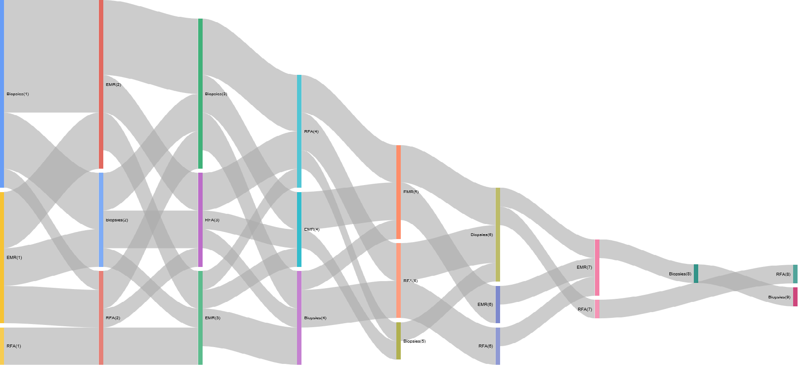

```{r global_options, include=FALSE}

library(knitr)
    library(data.table)
    library(dplyr)
    library(googleVis)
library(circlize)
knitr::opts_chunk$set(warning=FALSE, message=FALSE)
```

##The problem:

How do I visualise the flow of patients through a service? For example how do I see what order of therapies patients have received when they undergo Barrett's endotherapy for early malignancies or dysplasia?

###The background:

It is important to understand the sequence of events for any patients. In the above example, an ideal sequence should be that a patient undergoes endoscopic mucosal resection (EMR) prior to radiofrequency ablation and that no further EMR's are required. If this is not the sequence they we need to know why and determine if it is for example a problem with lesion recognition for a particular endoscopist.

Sankey plots are ideal for this. One of the most famous uses of a Sankey plot is a rather sad but effective visualisation of Napoleonic troop movements in his disasterous 1812 campaign to conquer Russia. There are of course numerous other examples.

The power of the plot comes from the fact that the flow of time of events is usually the X axis, categories that (in my case) patients move into is the y axis and the volume of movement is represented by the weight of the line.

This makes it perfect to understand patient flow through a defined sequence of events and effectively summarises the concept of patient 'flow'. An example of its use is given here:

###The example:

The problem: How do I determine the order of therapies for patients who have undergone endotherapy for Barrett's related early malignancies or dysplasia?

####Input data
```{r Data_Sankey_dataInput}

    #Generate some sample data:

proc<-sample(c("EMR","RFA","Biopsies"), 100, replace = TRUE)
#Sample dates
dat<-sample(seq(as.Date('2013/01/01'), as.Date('2017/05/01'), by="day"), 100)
#Generate 20 hospital numbers in no particular order:
HospNum_Id<-sample(c("P433224","P633443","K522332","G244224","S553322","D0739033","U873352","P223333","Y763634","I927282","P223311","P029834","U22415","U234252","S141141","O349253","T622722","J322909","F630230","T432452"), 100, replace = TRUE)
df<-data.frame(proc,dat,HospNum_Id)
```


##Data Preparation for Sankey plot
Now we prepare the data and convert it into a spredsheet format using data.table which can order the sequence of events per patient


```{r Data_Sankey_PrepareSankey}

    Sankey<-dcast(setDT(df)[, if(any(proc=="EMR"|proc=="RFA")) .SD, HospNum_Id], HospNum_Id~rowid(HospNum_Id), value.var ="proc")
Sankey<-data.frame(Sankey)
```


We need to rename columns and get rid of the first column which was only originally used to get the events patient specific. It won't be useful in the next steps so lets ditch it.

```{r Data_Sankey_MatrixSankey}
PtFlow<-Sankey%>%select(2:9)
PtFlow<-data.frame(PtFlow,stringsAsFactors=F)
names(PtFlow)<-c("ord1","ord2","ord3","ord4","ord5","ord6","ord7","ord8")

orders <- PtFlow %>%
  select(ord1, ord2, ord3, ord4, ord5,ord6,ord7,ord8)
orders.plot <- data.frame(from= character(0), to= character(0), n = numeric(0))
```   


So the data is in the current form

```{r Data_Sankey_TableMatrix}
  
    
     knitr::kable(orders)

``` 


So that creates the basic 'spreadsheet' for the creation of the Sankey on a per patient basis.

Now we have to summarise the number of 'movements' from one state to another for each patient and then for all the patients. The loop below basically looks at each row and then groups by the combination of subsequent events 
ie how many events were EMR->EMR, how many were Biopsies->EMR etc with each permutation of EMR, Biopsies and RFA. 
This is stored in ord.cache and then added cumulatively to orders.plot.

###Summarise the Data

```{r Data_Sankey_MatrixSummary}
for (i in 2:ncol(orders)) {
  ord.cache <- orders %>%
    group_by(orders[ , i-1], orders[ , i]) %>%
    summarise(n=n()) %>%
  ungroup()
  colnames(ord.cache)[1:2] <- c('from', 'to') 
  
  # adding tags
  ord.cache$from <- paste(ord.cache$from, '(', i-1, ')', sep='')
  ord.cache$to <- paste(ord.cache$to, '(', i, ')', sep='') 
  orders.plot <- rbind(orders.plot, ord.cache) 
}
    
```    


###Plot the data:

```{r Data_Sankey_FinishMatrixPrep}
orders.plot<-data.frame(orders.plot)
orders.plot<-orders.plot[grepl("[A-Z]",orders.plot$from)&grepl("[A-Z]",orders.plot$to), ]
orders.plot<-orders.plot[!grepl("NA",orders.plot$from)&!grepl("NA",orders.plot$to), ]
```   
   
   
Now it gets plotted with the googleVis package:
   
```{r, eval=FALSE}   
plot(gvisSankey(orders.plot, from='from', to='to', weight='n',
                options=list(height=900, width=1800)))

```

###The Sankey plot:
The resulting Sankey is as follows (yours may be different as the data is randomly generated):


<br><br><br><br><br><br>

##Data preparation for Circos Plots

Another way to visualise flow is to circularise the data. This is different to a Sankey plot as a) it's circular and b) the summarisation is a higher level so that rather than telling you how many patients underwent an eventA->eventB at a particular time point 1, it will tell you how many occurred over all the time points:

The data generation is as above

The data has to be cleaned slightly differently as follows:

```{r Data_Sankey_CircosDataInput} 

############################################################## Data preparation ###############################################################################
proc<-sample(c("EMR","RFA","Biopsies","Nothing"), 100, replace = TRUE)
#Sample dates
dat<-sample(seq(as.Date('2013/01/01'), as.Date('2017/05/01'), by="day"), 100)
#Generate 20 hospital numbers in no particular order:
Id<-sample(c("P43","P63","K52","G24","S55","D07","U87","P22","Y76","I92","P22","P02","U22415","U23","S14","O34","T62","J32","F63","T43"), 100, replace = TRUE)
df<-data.frame(proc,dat,Id)
```
<br>

Now we can summarise the data as we wish as follows:
  
<br>
  
```{r Data_Sankey_CircosSummarise} 
library(dplyr)
library(reshape2)

mydf<-df %>% 
  arrange(dat) %>% 
  group_by(Id) %>%
  mutate(origin = lag(proc, 1), destination = proc) %>%
  select(origin, destination) %>% 
  group_by(origin, destination) %>% 
  summarise(n = n()) %>% 
  ungroup()


mydf<-data.frame(dcast(mydf, origin ~ destination))
#mydf$origin<-as.character(mydf$origin)

#Get rid of NA's
mydf<-mydf[complete.cases(mydf),]

V1<-c("2","7","3","10")
V2<-c("210,150,12","110,255,233","125,175,0","255,219,0")

mydf<-cbind(V1,V2,mydf)

```
<br>

This creates the dataframe structure with the colour scheme embedded for each grouping. Note how the grouping was achieved with dplyr, where origin and destination columns were created by combining the current and the previous column values and then these columns were selected out, grouped and then summarised.

Now we have to create a matrix 

<br>

```{r Data_Sankey_CircosFormatData}

df_format <- mydf %>% select(1:3) %>% rename(order = V1, rgb = V2, region = origin) %>% mutate(region = gsub("_", " ", region))
  #flow matrix. Need to add V1 and V2 to the matrix here

  matmydf <- as.matrix(mydf[,-(1:3)])
  dimnames(matmydf) <- list(orig = df_format$region, dest = df_format$region)
  library("tidyr")
  df_format <- df_format %>% arrange(order) %>% separate(rgb, c("r","g","b")) %>% mutate(col = rgb(r, g, b, max=255), max = rowSums(matmydf)+colSums(matmydf))
```
<br>

##Plot the Circos plot

Having created that we are ready to plot a beautiful summary visualisation of the patient flow:

<br>

```{r Data_Sankey_CircosPlot}
  
  library("circlize")
  circos.clear()
  par(mar = rep(0, 4), cex=0.9)
  circos.par(start.degree = 90, gap.degree = 4)
  par(cex = 0.8, mar = c(0, 0, 0, 0))
  chordDiagram(x = matmydf, directional = 1, order = df_format$region, 
               grid.col = df_format$col, annotationTrack = "grid", 
               transparency = 0.25,  annotationTrackHeight = c(0.1, 0.1),
               diffHeight  = -0.04)
  
  
  circos.trackPlotRegion(track.index = 1, panel.fun = function(x, y) {
    xlim = get.cell.meta.data("xlim")
    sector.index = get.cell.meta.data("sector.index")
    circos.text(mean(xlim), 3.5, sector.index, facing = "bending")
    circos.axis("top", major.at = seq(0, max(xlim),by=5), minor.ticks=1,labels.cex=0.8, labels.away.percentage = 0.2, labels.niceFacing = FALSE )}, bg.border = NA)
```


    