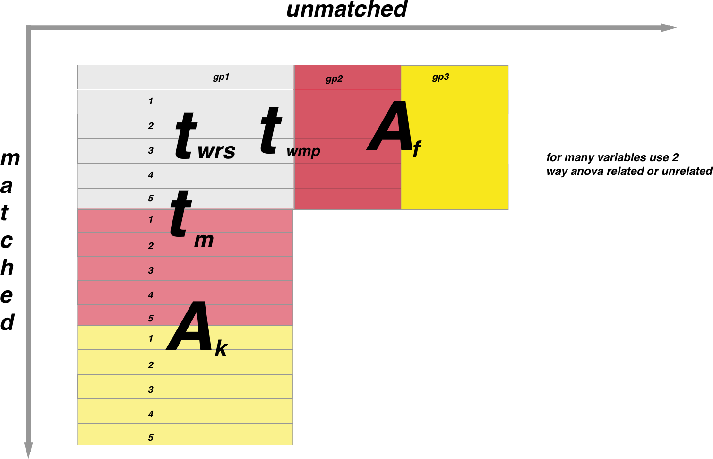

```{r setup, include=FALSE}
knitr::opts_chunk$set(echo = TRUE)
```

Statistics is always tricky especially for the non statistician. I find it easier to follow a flowchart to decide on the correct statistical test. Thie relies on understanding some semantics:

**Group**=sample ie the population that has been measured. If you have measured from two groups or populations then these are two samples eg between patients from one hospital and another hospital

**Observations**= the actual measurement eg the height of that patient.

**Matching** = Dependent= whether the population is matched eg repeated measures from the same subject ()

**Variable** = the parameter being measured eg height of patient. This is similar to a column in a standard spreadsheet.

There are many statistical tests to choose from so I use the following diagram to help me choose:

<br><br><br><br>



<br><br><br><br>

In the above figure, populations that are matched are along the y axis and unmatched along the x axis. Subscript letters are non-parametric tests and superscript are parametric as follows:

**wrs= Wilcoxon rank sums**

**wmp=Wilcoxon matched pairs**

**f=Friedman test**

**A (if matched)=Repeated measures one way ANOVA**

**A (if unmatched)=One way ANOVA**

**k=Kruskall-Wallis**

*Note the two sample unmatched t test could also be a Welch corrected unpaired t test if the variances are not equal.*

*Note the above diagram is when one variable is being compared between populations*

For example if you want to compare the mean of two unmatched populations around one variable you would use a unpaired t-test if the sampling was parametric or a Mann-Whitney U if it was non parametric.


R accomodates all of the stats tests there are so as a basic run through of them lets create our input dataframe

The tests are as follows:

<br><br><br><br><br><br>

##Parametric tests:

The following relate the the large letters along the y-axis in the diagram

###Matched data:

**1 sample:**
```{r, eval=FALSE}
# one sample t-test
y1 = c(18.2, 20.1, 17.6, 16.8, 18.8, 19.7, 19.1)
t.test(y1,mu=3) # Ho: mu=3
```
**2 sample:**
```{r Data_Stats_Parametric_MatchedTwoSample}
#Create the data frame
y1 = c(18.2, 20.1, 17.6, 16.8, 18.8, 19.7, 19.1)
y2 = c(17.4, 18.7, 19.1, 16.4, 15.9, 18.4, 17.7)
y = c(y1, y2)
n = rep(7, 2)
group = rep(1:2, n)
data = data.frame(y = y, group = factor(group))
# paired t-test
t.test(y1,y2,paired=TRUE) # where y1 & y2 are numeric
```

**Multiple samples:**

```{r Data_Stats_Parametric_MatchedMultipleSmaple}
#ANOVA for matched samples
y1 = c(18.2, 20.1, 17.6, 16.8, 18.8, 19.7, 19.1)
y2 = c(17.4, 18.7, 19.1, 16.4, 15.9, 18.4, 17.7)
y3 = c(15.2, 18.8, 17.7, 16.5, 15.9, 17.1, 16.7)
y = c(y1, y2, y3)
n = rep(7, 3)
group = rep(1:3, n)
data = data.frame(y = y, group = factor(group))
fit = lm(y ~ group, data)
anova(fit)
#Get the confidence intervals:
confint(fit)
#Plot it out in ggplot

new = data.frame(Fitted = fitted(fit),
  Residuals = resid(fit), Treatment = data$group)
#and then produce the plot:
library(ggplot2)
ggplot(new, aes(Fitted, Residuals, colour = Treatment)) + geom_point(size=18)

```


###Unmatched data:


**2 sample:**
```{r, eval=FALSE}
# independent 2-group t-test
t.test(y1,y2) # where y1 and y2 are numeric
```

**Multiple samples:**

This is the anova as illustrated above

<br><br><br><br><br><br>

##Non-parametric tests:


###Matched data:

**1 sample:**
```{r, eval=FALSE}
wilcox.test(y1,y2,paired=TRUE)
```

**2 sample:**
```{r , eval=FALSE}
wilcox.test(y1,y2,paired=TRUE)
```

**Multiple samples:**
```{r, eval=FALSE}
#Kruskall Wallis
kruskal.test(y~A) # where y1 is numeric and A is a factor
```

###Unmatched data:

**1 sample:**
```{r, eval=FALSE}
wilcox.test(immer$Y1, immer$Y2) 
```


**2 sample:**
<br><br>
```{r, eval=FALSE}
# dependent 2-group Wilcoxon Signed Rank Test 
wilcox.test(y1,y2,paired=TRUE) # where y1 and y2 are numeric
```

**Multiple samples:**
<br><br>
```{r, eval=FALSE}

friedman.test(y~A|B)
# where y are the data values, A is a grouping factor
# and B is a blocking factor
```
