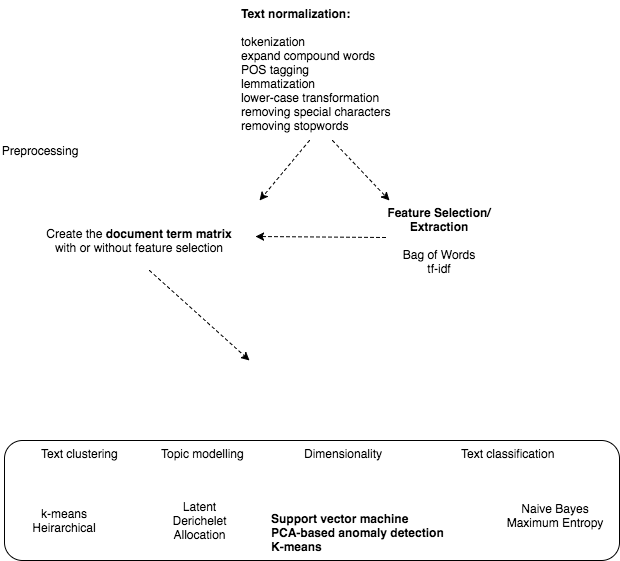

```{r global_options, include=FALSE}
knitr::opts_chunk$set(fig.width=12, fig.height=8, fig.path='Figs/',
                       warning=FALSE, message=FALSE)
library(knitr)
library(ggplot2)
library(tidytext)
library(tidyr)
library(broom)
library(tm)
```

###More advanced text analysis using Natural Language Processing
 
 One more advanced way to analyse text is by using natural language processing. Various packages exist for this but one of the most useful, because it shares the philosophy of tidy data, is tidytext. This uses many of the features of dplyr which is so heavily used on this site and also allows for the use of piping in the form of %>%
 
 Natural language processing deals with three main areas for text 
 
 1. Topic modelling- ie which topics are important in a model
 2. Dimensionality reduction - simplifying a text to examine its salient features
 3. Text clustering- an unsupervised grouping of documents according to mutual similarity
 4. Text classification -  a supervised technique to classify text.
 
 The approaches fall under the wider umbrella of machine learning. A good summary of r techniques for text mining is [here](http://data-analytics.net/cep/Schedule_files/Textmining%20%20Clustering,%20Topic%20Modeling,%20and%20Classification.htm) The figure demonstrates the algorithms we can use for each of the analytical areas:
 
<br><br>
 
  
  
<br><br>
 
 For example, lets say we have a lot of pathology reports and we want to get all the reports that contain a reference to candida. We can do the following:
 
 We are going to use the [pre-prepared dataset](http://gastrodatascience.com/PrepreparedEndoHistData.html) for this:

```{r TextClean_PreparedDS}
#To get the prepared endoscopy reports we are going to use the pre-prepared dataset here:
EndoHistoMerge<-source('EndoPathMerged_ExternalCode.R')
EndoHistoMerge<-as.data.frame(EndoHistoMerge)
names(EndoHistoMerge)<-gsub("value.","",names(EndoHistoMerge),fixed=T)
```
 
 
 
### An example of pre-processing using NLP- simple tokenisation

As we can see from the summary diagram, there are a few steps before we start processing the data. This is called pre-processing and is basically a form of data cleaning. An example of one part of the pre-processing, called tokenisation is shown below using the tidytext package:

```{r tidytext}
library(tidytext)
mytidy<-head(EndoHistoMerge,100)%>%
unnest_tokens(word, Diagnoses) %>%
anti_join(stop_words)%>%
count(word, sort = TRUE) %>%
  filter(n > 30) %>%
  mutate(word = reorder(word, n)) %>%
  ggplot(aes(word, n)) +
  geom_col() +
  xlab(NULL) +
  coord_flip()

mytidy
```

<br><br>
This takes the EndoHistoMerge dataset, splits out the words (a process called tokenisation and which can also be done for sentences, n-grams and paragraphs) so that one word is on one row and also removes stop_words such as "and", "the" etc. The format of the dataframe is now in tidy format around the words from the pathology report. This is great as ggplot loves tidy formatted data so we can pipe straight into a graph.

An alternative way to pre-process text is to use the tm package as follows:
```{r textPreprocessing_With_R}
mywords<-head(EndoHistoMerge$Diagnoses,100)
jeopCorpus <- Corpus(VectorSource(mywords))
  #jeopCorpus <- tm_map(jeopCorpus, PlainTextDocument)
  jeopCorpus <- tm_map(jeopCorpus, content_transformer(removeWords), stopwords("english"))
  jeopCorpus <- tm_map(jeopCorpus, removePunctuation)
  jeopCorpus <- tm_map(jeopCorpus, stripWhitespace)
  jeopCorpus <- tm_map(jeopCorpus, removeWords, stopwords('english'))
  jeopCorpus <- tm_map(jeopCorpus, stemDocument)
  
  
  #wordcloud(jeopCorpus, max.words = 100, random.order = FALSE)
  
  #Get the frequency table of terms being used over all the reports (ie counts x2 if mentioned twice in the report)
  dtm <- TermDocumentMatrix(jeopCorpus)
  m <- as.matrix(dtm)
  v <- sort(rowSums(m),decreasing=TRUE)
  d <- data.frame(word = names(v),freq=v)
```
  
<br><br>

### Using NLP to determine commonly used phrases - n-gram tokenisation
 
 One particularly interesting use of NLP is to determine the commonly used phrases in a report. I find this useful to study how doctors might express their findings but particularly how negative findings (ie the lack of a diagnosis) are expressed. This is particularly important as we may want to exclude 'negative' findings so that they don't confuse word searches and cause over-estimates in our analysis:
 
We again start with the EndoMerge dataset, but this time we are going to tokenize according to n-grams. Note how we don't exclude stop words here because we are interested in sentences that have no and neither etc. The top 10 are shown here. So now we can sift through them and in our algorithm for negative detection we can see what the most common negatives are:
<br><br>


```{r ngrams}
ngramEndoHistoMerge<-EndoHistoMerge%>%
  unnest_tokens(trigram, Diagnoses, token = "ngrams", n = 3) %>%
  separate(trigram, c("word1", "word2", "word3"), sep = " ") %>%
  count(word1, word2, word3, sort = TRUE)
# kable(head(ngramEndoHistoMerge,10))
```

<br><br>

So now of course we can graph it because that's what we love to do:


```{r trigrams}

triigrams_united <- ngramEndoHistoMerge %>%
  unite(trigram, word1, word2,word3, sep = " ")

ggplot(head(triigrams_united,20), aes(trigram, n)) +
  geom_histogram(stat="identity",show.legend = FALSE) +
  theme(axis.text.x=element_text(angle = -90, hjust = 0))

```

<br><br>

### Clustering algorithms using NLP

In fact text mining can get pretty interesting very quickly. Let's say we can't to be able to cluster endoscopy reports based on their content. Maybe we think that they will cluster according to endoscopist, or maybe we are interested to see if everyone reports the same type of disease similarly or differently.

To to this we need to take the document term matrix we created above and make it into a formal matrix as follows:


```{r cluster}

mywords<-head(EndoHistoMerge$Diagnoses,100)
jeopCorpus <- Corpus(VectorSource(mywords))
  #jeopCorpus <- tm_map(jeopCorpus, PlainTextDocument)
  jeopCorpus <- tm_map(jeopCorpus, content_transformer(removeWords), stopwords("english"))
  jeopCorpus <- tm_map(jeopCorpus, removePunctuation)
  jeopCorpus <- tm_map(jeopCorpus, stripWhitespace)
  jeopCorpus <- tm_map(jeopCorpus, removeWords, stopwords('english'))
  jeopCorpus <- tm_map(jeopCorpus, stemDocument)
  
  
  #wordcloud(jeopCorpus, max.words = 100, random.order = FALSE)
  
  #Get the frequency table of terms being used over all the reports (ie counts x2 if mentioned twice in the report)
  dtm <- TermDocumentMatrix(jeopCorpus)
  m <- as.matrix(dtm)
  v <- sort(rowSums(m),decreasing=TRUE)
  d <- data.frame(word = names(v),freq=v)

distMatrix <- dist(m, method="euclidean")


groups <- hclust(distMatrix,method="ward.D")
{plot(groups, cex=0.5, hang=-1)
rect.hclust(groups, k=15)}
```

<br><br>

So now we can see how specific terms are related to each other. ANother way of clustering that is very popular is k-means clustering We can do this using the cluster package. A simple example of what the algorithm is all about can be found [here:](https://eight2late.wordpress.com/2015/07/22/a-gentle-introduction-to-cluster-analysis-using-r/)

```{r kmeanscluster, eval=F}
kfit <- kmeans(d, 5, nstart=100)
#plot – need library cluster
library(cluster)
clusplot(m, kfit$cluster, color=T, shade=T, labels=2, lines=0)
```

but you will notice that it doesn't tell you anything about the clusters, just that there are two clusters and certain endoscopy reports fall within these clusters.
<br><br>

###Topic modelling

The difference between topic modelling and text clustering is subtle. In clustering you are deciding how to group documents based on how similar they are. This is based on the weighting of the words which itself relies on tf-idf (term frequency-inverse document frequency) . In topic modelling you are representing a document as a function of the topics in it so that topic modelling returns a list of topics within a document whereas clustering returns groups that documents belong to. You can use topic modelling to do clustering as well.

<br><br>

Topic modelling is often done with Latent Dirichelet Allocation (LDA). To quote another [source](http://tidytextmining.com/topicmodeling.html#latent-dirichlet-allocation), "LDA is a mathematical method for estimating both of these at the same time: finding the mixture of words that is associated with each topic, while also determining the mixture of topics that describes each document"

We can use it to solve the following issue: How can I decide who wrote the following reports, or How can I decide what the combined method of reporting is for a certain illness and what is the variation in reporting?

We will use the [topicmodels](https://cran.r-project.org/web/packages/topicmodels/index.html) package to run the LDA() function. This takes a document term matrix as its input.

<br>

```{r,eval=F}

#library(topicmodels)- should be included although server can't install
#Create the document term matrix
mywords<-head(EndoHistoMerge$Diagnoses,100)
jeopCorpus <- Corpus(VectorSource(mywords))
  #jeopCorpus <- tm_map(jeopCorpus, PlainTextDocument)
  jeopCorpus <- tm_map(jeopCorpus, content_transformer(removeWords), stopwords("english"))
  jeopCorpus <- tm_map(jeopCorpus, removePunctuation)
  jeopCorpus <- tm_map(jeopCorpus, stripWhitespace)
  jeopCorpus <- tm_map(jeopCorpus, removeWords, stopwords('english'))
  jeopCorpus <- tm_map(jeopCorpus, stemDocument)
  
  
  #wordcloud(jeopCorpus, max.words = 100, random.order = FALSE)
  
  #Get the frequency table of terms being used over all the reports (ie counts x2 if mentioned twice in the report)
  dtm <- t(TermDocumentMatrix(jeopCorpus))
  m <- as.matrix(dtm)
  v <- sort(rowSums(m),decreasing=TRUE)
  d <- data.frame(word = names(v),freq=v)
ap_lda <- LDA(dtm, k = 2, control = list(seed = 1234))

```

This then allows us to determine which topics are more or less likely to have particular words. It shows the probabilities in each document so you can see how they are similar or dissimilar

```{r,eval=F}
library(tidytext)
head(ap_topics<-tidy(ap_lda, matrix = "beta"),10)
```

<br>

but because we love to visualise things, we will plot this out

```{r,eval=F}
library(ggplot2)
library(dplyr)

ap_top_terms <- ap_topics %>%
  group_by(topic) %>%
  top_n(10, beta) %>%
  ungroup() %>%
  arrange(topic, -beta)

ap_top_terms %>%
  mutate(term = reorder(term, beta)) %>%
  ggplot(aes(term, beta, fill = factor(topic))) +
  geom_col(show.legend = FALSE) +
  facet_wrap(~ topic, scales = "free") +
  coord_flip()
```

<br>

Of course we have to remember this is heavily generated data but the LDA function has defined two document types and the graph above shows how they have been characterised.

Another method is to look at what the greatest differences are between topics. The [mutate](http://gastrodatascience.com/WranglingDataFromDataMutate.html#using_ifelse()_with_mutate_for_conditional_accordionisation) column is logged to make the result symmetrical


```{r,eval=F}
library(tidyr)

beta_spread <- ap_topics %>%
  mutate(topic = paste0("topic", topic)) %>%
  spread(topic, beta) %>%
  filter(topic1 > .001 | topic2 > .001) %>%
  mutate(log_ratio = log2(topic2 / topic1))

beta_spread %>%
   mutate(term = reorder(term, log_ratio)) %>%
    filter(topic1 > .01 | topic2 > .01) %>%
  ggplot(aes(term, log_ratio)) +
  geom_col(show.legend = FALSE)  +
  coord_flip()

```
I will also discuss the other important aspects of text mining namely text classification.....when I get round to it...