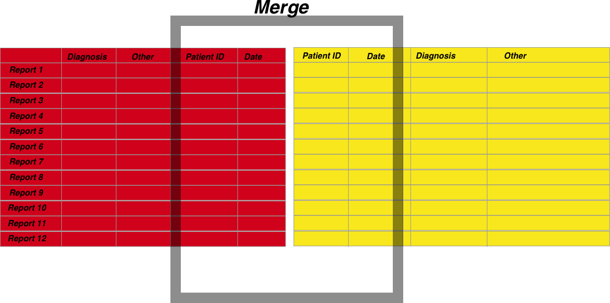
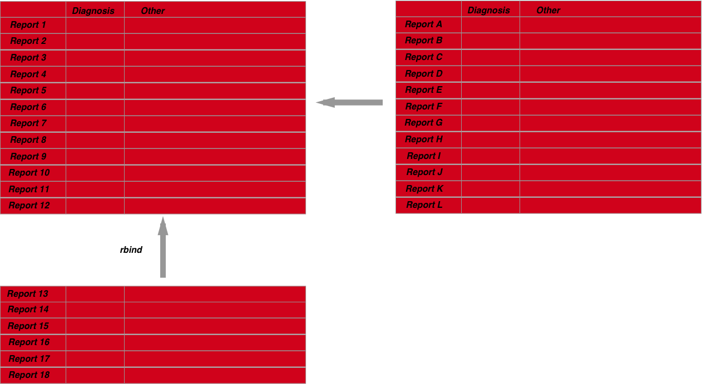
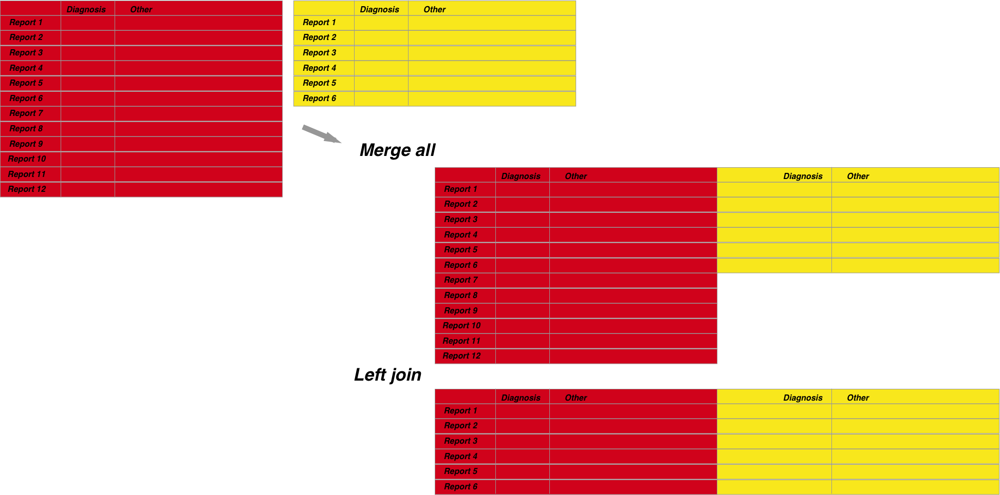

```{r setup, include=FALSE}
knitr::opts_chunk$set(echo = TRUE)
```

It is unusual to have all data you want to analyse within one dataset. As a result being able to merge data from different datasets is crucial. Merging isn't as straightforward as you may think. The principles are as follows

 1. Choose columns to merge on where the resulting merge will result in a unique row. For example let's say you have two datasets, an endoscopy and a pathology dataset. Both datasets will contain the Hospital number of the patient the report is written for. However, one patient may have many pathology reports, or perhaps many endoscopies but only one where any pathology was taken. You're job is to figure out which pathology report should be associated with which endoscopy report
 
 
 
 2. Merging can also happen when you have two subsets from the same dataset and you need to add them together. This is different to classic merging as above and is usually done with the base R functions cbind and rbind



 3. When merging you should also be careful to understand what you are including in the merge. Lets say you have a pathology dataset with 10 records but an endoscopy dataset with 100 records. Do you want to merge so you include only the data which have matched records, or do you want to include all endoscopy regardless of whether a matched pathology record is present as well?



##Situation 1- merging different datasets

####I want to merge a pathology dataset with an endoscopy dataset so that the endoscopy has the correct associated pathology for that dataset

Firstly lets create the dataset. You will notice that the dates are slightly different between Endoscopy and path reports for some patients. This is real life where the date received for the pathology numbers can be slightly different to the date of the endoscopy.


```{r}
#Creating the datasets

#Random letters to fill out a pathology report
pathRep<-replicate(20,paste(sample(LETTERS,20,replace=T),collapse=""))
pathDate<-as.Date(c("1993-12-22","1994-05-16","1992-07-20","1996-06-02","1992-04-20","1996-08-30","1992-01-26","1991-03-23","1995-12-28","1995-07-15","1993-04-04","1994-01-11","1999-08-21","1993-11-10","1994-02-26","1992-08-06","1993-06-29","1997-03-08","1998-03-03","1998-04-17"))
pathHospitalNum<-c("H432243","T662272","G424284","W787634","H432243","Y980037","H432243","W787634","Y980037","E432243","U874287","Y980037","U874287","W787634","Y980037","H432243","Y980037","E432243","W787634","W787634")
#Create the dataframe
pathdf<-data.frame(pathRep,pathDate,pathHospitalNum)

#Random letters to fill out a pathology report
EndoRep<-replicate(20,paste(sample(LETTERS,20,replace=T),collapse=""))
EndoDate<-as.Date(c("1993-12-22","1994-05-14","1992-07-19","1996-06-01","1992-04-20","1996-08-30","1992-01-24","1991-03-21","1995-12-28","1995-07-15","1993-04-02","1994-01-10","1999-08-21","1993-11-10","1994-02-26","1992-08-05","1993-06-29","1997-03-07","1998-03-03","1998-04-17"))
EndoHospitalNum<-c("H432243","T662272","G424284","W787634","H432243","Y980037","H432243","W787634","Y980037","E432243","U874287","Y980037","U874287","W787634","Y980037","H432243","Y980037","E432243","W787634","W787634")
#Create the dataframe:
Endodf<-data.frame(EndoRep,EndoDate,EndoHospitalNum)

```

A simple way of merging for this ultrasimplified dataset is just to use the function merge() in base R. We will choose the columns date and Hospital number to do this:
Before we do this we have to name the columns to merge the same so R can recognise them
```{r}
names(Endodf)<-c("Report","Date","HospNum")
names(pathdf)<-c("Report","Date","HospNum")
```

Now we are ready to merge:

```{r}
themerge<-merge(Endodf,pathdf,by=c("Date","HospNum"))
themerge
```

But note, the result set only includes 11 records. That is because we are merging according to where the records, both Hospital Number and date, are the same. So lets loosen that up a little and lets allow the merge to match if the date is up to 4 days out (to allow delays in transit from the endoscopy unit to the pathology department, samples stored in fridges over bank holidays etc..).
To do this we are going to create use data.table


```{r}
library(data.table)
pathdt<-data.table(pathRep,pathDate,pathHospitalNum)
setkey(pathdt, pathHospitalNum, pathDate)

Endodt<-data.table(EndoRep,EndoDate,EndoHospitalNum)
setkey(Endodt, EndoHospitalNum, EndoDate)

#run the join
themerge2<-Endodt[pathdt,roll="nearest"]
```

There is of course an alternative way to do this using a package called fuzzyjoin and dplyr

```{r}
library(fuzzyjoin)
library(dplyr)
#Rename the columns so can do the join
names(Endodf)<-c("EndoRep","Date","EndoHospitalNum")
names(pathdf)<-c("pathRep","Date","pathHospitalNum")
themerge3 <- 
  fuzzyjoin::difference_full_join(Endodf, pathdf, by = 'Date', max_dist = 2, distance_col = 'Days') %>%
  filter(EndoHospitalNum == pathHospitalNum) 
```
