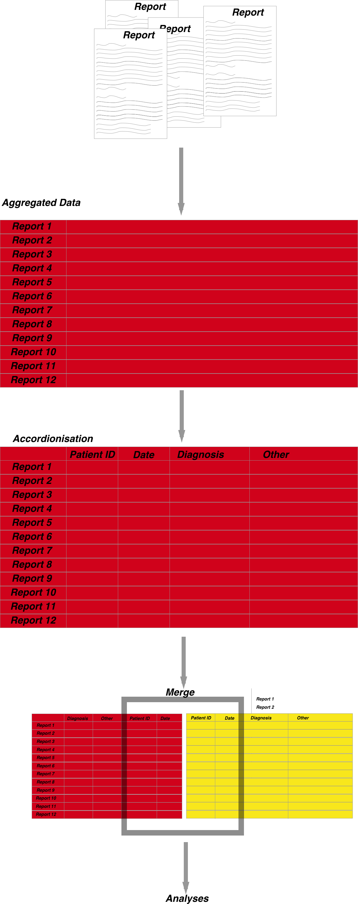

```{r setup, include=FALSE}
knitr::opts_chunk$set(echo = TRUE)
```

All data needs to be prepared. This is extremely time consuming. Below illustrates the process of preparation for data in gastroenterology with a focus on endoscopic- pathological data sets.

Overview of steps for any analysis:
The steps for the preparation of a full dataset incorporating both endoscopic and associated pathological data are as follows: 


### 1. Data acquisition- 

Usually Pathology results and endoscopic results are stored separately. 

### 2. Data cleaning- 

This requires the data to be extracted from its semi-structured state into individual columns as detailed below ### 3. Data merging- where endoscopy and pathology datasets are stored separately they need to be merged according to episode date 

### 3. Data merging- 

### 4. Data accordionisation- 

for ease of analysis some data can be extrapolated from the existing dataset and entered into it’s own column- for example determining the maximal extent of a Barrett’s segment can be calculated from the report text and entered into its own column. This is very much dependent on the aim of the analysis 

### 5. Data analysis

### 6. Results visualisation





