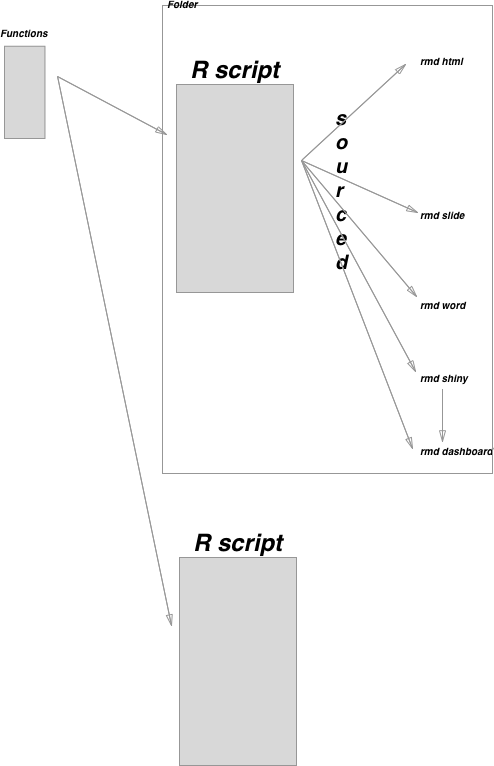

```{r setup, include=FALSE}
knitr::opts_chunk$set(echo = TRUE)
```

## Overview of R workflow

We should all work smarter rather than harder. I never want to duplicate anything apart from fun and holidays. Reusability is the key to a happy life. So on that note I think a brief overview of how to work efficiently in R is in order.

The diagram below summarises how to organise your R scripts. In general anything that looks like it is going to be used between scripts should be created as a function and categorised amongst similar functions. I have a file called CleanUp.R that performs all of the data cleaning functions and another called Analytics that is separated into Surveillance functions, Quality functions and Yield and scheduling functions. I use all my functions a lot in many R scripts.

The R script itself should be one piece of work and should be categorised according to the subject it addresses. Eg an R script I wrote recently looking at the sensitivity of barium swallows for dysmotility sits in my physiology folder in a subfolder called dysmotility_barium.

This R script is templated according to the principle of data wrangling. Each script has an import section, cleaning, merging, accordionisation and grouping section. It then ends with an analysis section in which plots are generated (usually as ggplots) and saved as objects. At the very end of the R script I keep the code documentation.

On the basis that the business logic of coding in any language should be separated from the presentation logic, I also keep markdown files separate (but in the same folder). Each markdown sources the parent R script so that if the analysis changes in the R script, whichever outputs I have created with that script will also change. I use the objects created in the parent R script and reference them in the rmarkdown without creating new objects as much as possible. This also reduced the amount of code in the markdown files.

I normally input the R script into the Presentation layer (shiny or flexdashboard etc) by sourcing the script via the "source()" function and then I can use all the objects in the original R script eg ggplots etc.





[shiny](http://rmarkdown.rstudio.com/authoring_shiny.html)


##Flexdashboard

The flexdashboard is a really nice presentation layer than can be used with or without interactivity (ie Shiny). It is a good way to share summarised data for example. Rather than walk you through all the features which you can find [here](http://rmarkdown.rstudio.com/flexdashboard/), I will simply present you with my template which you can cut and paste into your flexdashboard document (remember you need to install the package first and then run as a new Rmarkdown document)


```{r eval=F}
---
title: "Upper GI Dashboard"
output: 
  flexdashboard::flex_dashboard:
    orientation: rows
---

Barrett's
===================================== 
  
  
 Row 
-------------------------------------
   
### Patients awaiting follow-up

R CODE HERE

### Patients lost to follow-up

R CODE HERE
 

Row {.tabset}
-------------------------------------
   
### Surveillance Charts

R CODE HERE

### Endoscopic Performance Charts
    
R CODE HERE


### Diagnostic Yield Charts

R CODE HERE

### Patient Flow Charts

R CODE HERE


   
Eosinophilic Oesophagitis
=====================================     

Column {.tabset}
-------------------------------------
   
### Surveillance Charts

R CODE HERE
 
### Endoscopic Performance Charts
    
R CODE HERE


### Diagnostic Yield Charts

R CODE HERE

### Patient Flow Charts

R CODE HERE

Oesophageal Physiology Huddle
=====================================     

Column {.tabset}
-------------------------------------
   
### Patient Outcomes summarised

R CODE HERE
 
### Free slots in next month

R CODE HERE


### Summarised throughput

R CODE HERE

```


##Presentations:

It is also possible to produce presentations from your code. This is straightforward using [ioslides](http://rmarkdown.rstudio.com/ioslides_presentation_format.html) as is shown below:


```{r eval=F}
My new presentation template
========================================================
author: 
date: 
autosize: true

Introduction
========================================================

For more details on authoring R presentations please visit <https://support.rstudio.com/hc/en-us/articles/200486468>.

- Bullet 1
- Bullet 2
- Bullet 3

Aims
========================================================

R CODE HERE

Methodology
========================================================

R CODE HERE

Results
========================================================

R CODE HERE

Conclusion
========================================================

blaballba

```


Shiny:

Shiny apps are a little more involved. To create one you need to create the following steps:

1. Create an app (either as a single document in which case it is called app.R or as a two file app consisting of ui.R and server.R within a folder called app)

2. If going for the two file route use as follows:


#ui.R

```{r eval=F}
library(shiny)
library(shinydashboard)

# Define UI for application that draws a histogram
dashboardPage(skin="red",
  
  dashboardHeader(title="St Thomas' Physiology Data Console"),
  

  # Sidebar with a slider input for the number of bins
  dashboardSidebar(width='25%',
                   tags$head(
    tags$link(rel="stylesheet",type="text/css",href="boostrap.css")
  ),
    sidebarPanel(id="sidebar",width='125%',
      sliderInput("DatesMerge",
                  "Dates:",
                  min = as.Date("2006-01-01","%Y-%m-%d"),
                  max = as.Date("2016-01-01","%Y-%m-%d"),
                  value=as.Date("2006-01-01"))    
    )),
    
    
    
    # Show a plot of the generated distribution

      dashboardBody(
        tags$head(
          tags$link(rel="stylesheet",type="text/css",href="boostrap.css")
          ),
     
        
        tabsetPanel(
          tabPanel("HRM", 
                   br(),
                   br(),
                   tabsetPanel(  
                    
                     tabPanel("All HRMs",plotOutput("distPlotHRM")),
                     tabPanel("Achalasia Type 1",plotOutput("Achal1")),
                   )
                  ),
          tabPanel("Impedance",plotOutput("distPlotImp"))
          
        )
    )
  )
```


###server.R

```{r eval=F}

library(shiny)

source("S:\\Gastroenterology\\Seb\\R\\Scripts\\Management_Physiology\\PhysiolServiceUsage.R")

# Define server logic required to draw a histogram
shinyServer(function(input, output) {

  output$distPlotLactul <- renderPlot({
    #Create the data  
    TotsLactul<-TotsLactul[TotsLactul$DatesMerge>input$DatesMerge,]
    
    # draw the histogram with the specified number of bins   
   ggplot(TotsLactul)+
     geom_bar(aes(DatesMerge,fill=year))+
     labs(title=paste("Number of Patients undergoing Lactulose Breath Tests"))
  })
  

})


```


###run.R

```{r eval=F}
require(shiny)
folder_address = 'S:\\Gastroenterology\\Seb\\R\\Scripts\\Management_Physiology\\app'
runApp(folder_address, launch.browser=TRUE)
```

##Other

Other instructions for other ways to present your data can be found here:

[rmarkdown wesbites](http://rmarkdown.rstudio.com/rmarkdown_websites.html)

[rmarkdown html](http://rmarkdown.rstudio.com/html_document_format.html)


