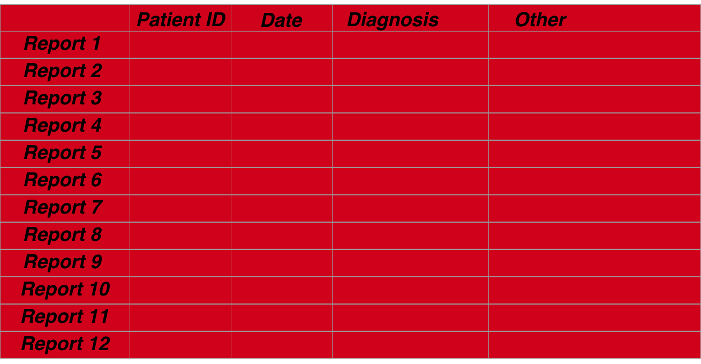

##Introduction 

Gastroenterological data can be organised in a manner that allows several questions to be answered with the same data structure. The structure itself is straightforward. It simply rests on the basis that we mainly describe patient episodes so that each row of a dataframe pertains to the data collected at that episode and the index of the row is based on a combination of date and a patient's unique identifier

The following described an overview of how data should be structured using both and endoscopic dataset and a pathological dataset which we will merge.

###**Medical data is electronic**

Medical data is increasingly kept in an electronic format worldwide. This serves many purposes including more efficient storage, distribution and accessibility of patient-focussed data. As important is the ability to analyse healthcare data for to optimize resource deployment and usage.  The tools for the analysis are often statistical and rely on the provision of ‘clean’ datasets before this can be done. ‘Cleaning’ a dataset is often the most difficult aspect of any data analysis and involves the provision of meaningful and well-formatted data so that the interpretation of the analysis is not subject to the doubts of the data quality.

###**Analyses of electronic data should also be electronic**

The analysis itself, especially analysis that involves optimization or monitoring of regularly utilized services, is likely to be re-used so that a reproduced analysis needs to be done with the same tools as the original analysis- the principle of reproducible research and an essential part of auditing and governance so that perceived improvements in practice are not simply a function of a change in the analytic methodology.

The British Society of Gastroenterology recommends that all endoscopic data is kept in an electronic format particularly to facilitate audit and maintain standards through the Global Rating Scale (GRS), a fundamental aspect of improving and maintaining high quality endoscopic performance. The endoscopic dataset is however only part of the patient’s story as many aspects of a patient’s gastroenterological care depend on the results of histopathological analysis of tissue taken during the examination. Pathology results are usually  available many days after the endoscopic result and usually stored in a separate data repository, although this may change with the arrival of a more encompassing electronic patient records. 

###**Medical data should be organised**

Regardless of the method of storage, it is often difficult to associate the particular histopathological result with an endoscopic result because data is often stored at a departmental level in different repositories. Further, even if the two data sets can be merged, a problem occurs in the isolation of various parts of each report such that each part can be individually analysed.  Examples include the isolation of who the endoscopist was or the presence of dysplasia within a histopathology report. This is all the more difficult if the report is unstructured or partially structured free text. 

###**Electronic analyses can only be done with organised data**

However if this can be done then many downstream analyses which benefit individual patients as well as the department, can be automated and include more complex analyses to determine follow-up regimes or endoscopic –pathologic lesion recognition performance. It is the purpose of this paper to demonstrate a methodology to merge endoscopy with pathology reports and extract units of data from both. The paper also demonstrates how crucial questions that are asked of datasets repeatedly in endoscopy can be answered in an automated way as long as the dataset is prepared well. Finally the paper validates the methodology using an actual dataset from a single trust. The methodology is available in scripted format using the statistical programming tool, R (ref) as a package (EndoMiner).

###**Reproducible research is a corenerstone of good day to day govenernance**

From a day to day point of view, reproducibility of research is integral to the principle of audit. To be able to perform exactly the same method of analysis on multiple datasets allows a fair result comparison that is removed from criticism of the difference in methodologies. Electronic data allows us to specify in code, the analysis that needs to be done and of course re-run that code with a new dataset.

All data needs to be prepared. This is extremely time consuming. Below illustrates the process of preparation for data in gastroenterology with a focus on endoscopic- pathological data sets.
   

##Overview of steps for any analysis:

The steps for the preparation of a full dataset incorporating both endoscopic and associated pathological data are as follows: 

### 1. Data acquisition- 

Usually Pathology results and endoscopic results are stored separately. Unless you are fortunate, many hospitals are unable to give you all the results you want aggregated for example on a spreadsheet. Given the data is stored electronically I find this incredible but it happens. You may find yourself extracting data, for example, from a folder full of word documents or pdf's. This kind of data acquisition is beyond this site, but there are many tools in R that can extract data for you and collate it into a dataframe.

   

   

   

### 2. Data cleaning- 

 Data cleaning is the most difficult challenge any data analyst faces. It involves preparing the data intelligently so that analyses can be performed. There are many steps to cleaning data. This includes ensuring completeness of the dataset, validating it, removing data (or not) with missing entries, correcting spelling mistakes,removing duplicates and so on. One of the most difficult cleaning jobs is text, and especially unstructured or semi-structured text. Overall data cleaning should ensure *data integrity*. Never forget that this should take up 80% of an analyst's time because, as the simple aphorism says**"Rubbish in =Rubbish out"**
   

 
### 4. Data accordionisation- 
 
 The data has to be extracted into uniform meaningful categories (a column of a dataframe) and then formatted so that the data is well described (eg dates as date objects rather than characters etc). This is really for ease of analysis. For example, determining the maximal extent of a Barrett’s oesophagus segment can be calculated from the report text and entered into its own numeric column. This is very much dependent on the aim of the analysis.

   

   

### 3. Data merging- 

The merging of datasets is a very common tasks because if you want meaningful analyses you often need multiple sources. In hospital level data the most important thing to understand is that data is organised around the dual index of a unique patient identifier and an episode date. Therefore if you want to merge datasets you need to have these columns organised and similarly formatted. Furthermore because you may want to associate episodes that do not have exactly the same dates, this needs to be accomodated into the merging algorithm.

    

   

### 5. Data analysis

This should be straightforward if the data is properly prepared. Given R is a statistical language, there are a wealth of packages available to do whatever you want. You are only limited by your question. But of course the analysis is not quite the final step

### 6. Results visualisation

The communication of results is really what convinces people to make changes. Florence Nightingale is often labelled as an influential statistician but in fact her ability was in the communication of results and her graphics depicting the disease burden in soldiers in the Crimean war is really what influenced Parliament. Most people are not statisticians but everyone can understand a well crafted picture.

   

##Assumptions for practical gastroenterological datasets

 

###Assumption 1 (Mandatory): 

A fundamental assumption is that all patient related data at the departmental level can be viewed as pertaining to a clinical episode recorded as a single timepoint (usually as the day of the episode. A single patient is related to patient timed episodes in a one to many relationship (one patient can have many endoscopies).

###Assumption 2 (Mandatory):

All patients have a unique identifier. At the departmental level this is likely to be a Trust specific hospital number.

###Assumption 3 (Optional): 

A patient episode should have an outcome. In the case of an endoscopy for example, the outcome may be the histopathological diagnosis, or if no biopsies were taken, then the endoscopic diagnosis. The origin of the outcome is not important: it can be a derivative of the dataset itself or can be from a distinct dataset merged into the current one depending on the analysis. What is important is that the outcome relates to the patient episode: if biopsy result is the outcome it should be biopsies taken at the recorded endoscopy. In other words the outcome should be that which is related to the same timepoint as the event.

###Assumption 4 (Optional): 

A patient episode should have a reason. The indication for the patient episode should be recorded for the same time point as the episode. This is very commonly found in report text of both an endoscopy and histopathology reports. This is optional as other analyses can still be carried out without this being available.

###Assumption 5 (Optional): 

A patient episode should have recordable variables. Examples of this for endoscopic data may be who performed the procedure, the length of time a procedure took and other variables derived from an endoscopy report. A histopathology report may contain information about the number of biopsies taken, their location and size as well as diagnoses among other aspects.

###Assumption 6 (Optional): 

The data is semi-structured. Structured data is easier to analyse but because it is more cumbersome to input and often lacks flexibility most endoscopic and histopathology data remains semi-structured. This means that although the text extraction techniques outlined here are the same, the boundaries for extracting each section may differ. For example in our trust a pathology report may contain the subsections ‘Macroscopic specimen’ and ‘Diagnosis’ whereas these sections may have alternative labels in another hospital’s report.

Semi-structured data requires specific language processing techniques depending on what is being extracted. For our purposes the extractible data is likely to be either diagnoses or aspects of the test being performed. The diagnostic data is traditionally the most difficult to extract  but this is often because the object to be extracted is from a large set eg for the purposes of coding for financial remuneration. Because the target set is much smaller for endoscopic-pathological diagnoses language extraction can be more focused whilst being more flexible to accommodate edge cases such as misspellings, plurals.

